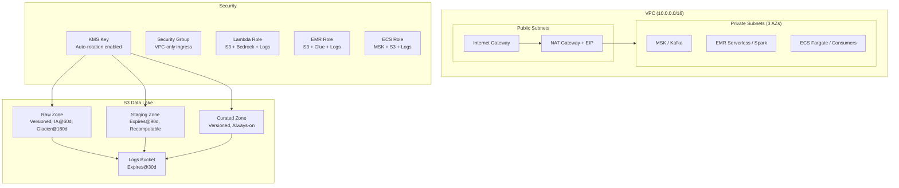

# ShopStream — Terraform Data Platform

Infrastructure as Code for an e-commerce data platform on AWS. Provisions networking, data lake storage, encryption, and IAM roles for data services.

## Architecture



## Data Lake Zones

| Zone | Purpose | Lifecycle | Versioning | Encryption |
|------|---------|-----------|------------|------------|
| Raw | Immutable landing — data as received | IA@60d, Glacier@180d | Enabled | KMS |
| Staging | Cleaned/transformed intermediate | Delete@90d | Disabled | KMS |
| Curated | Business-ready, served to consumers | Old versions expire@30d | Enabled | KMS |
| Logs | Access logs from all zones | Delete@30d | Disabled | AES-256 |

## IAM Roles (Least Privilege)

| Role | Trusted Service | Permissions |
|------|----------------|-------------|
| `shopstream-dev-lambda-role` | Lambda | Read/write raw+staging, Bedrock invoke, CloudWatch logs |
| `shopstream-dev-emr-role` | EMR Serverless | Read raw+staging, write staging+curated, Glue catalog, logs |
| `shopstream-dev-ecs-task-role` | ECS Tasks | MSK read/write, write staging, logs |

## Prerequisites

- Terraform >= 1.5.0
- AWS CLI configured with credentials
- AWS account with permissions to create IAM, S3, VPC, KMS resources

## Usage

```bash
# Set credentials
source .env

# Initialize Terraform
terraform init

# Preview changes
terraform plan

# Deploy
terraform apply

# Tear down
terraform destroy
```

## File Structure

```
terraform-data-platform/
├── main.tf          # Provider configuration + default tags
├── variables.tf     # Input variables (region, environment, project name)
├── s3.tf            # Data lake: 4 buckets + KMS key + lifecycle + logging
├── vpc.tf           # Networking: VPC, subnets, NAT, route tables, security group
├── iam.tf           # IAM roles + policies for Lambda, EMR, ECS
├── outputs.tf       # Exported values (bucket names, VPC ID, subnet IDs)
├── .env             # AWS credentials (gitignored)
└── .gitignore       # Excludes .env, .terraform/, state files
```

## Cost Estimate

| Resource | Monthly Cost |
|----------|-------------|
| NAT Gateway | ~$35 |
| KMS Key | ~$1 |
| S3 (minimal data) | < $1 |
| VPC/Subnets/SG | Free |
| IAM Roles | Free |
| **Total** | **~$37/month** |

## Design Decisions

- **KMS over AES-256**: Provides audit trail (CloudTrail logs decryption calls) and ability to revoke access by revoking key permissions
- **3 private subnets**: MSK requires minimum 3 AZs for high availability
- **Separate lifecycle per zone**: Raw ages to cold storage (still retrievable), staging expires (recomputable from raw), curated stays hot (queried frequently)
- **Separate IAM policies per concern**: Each service gets only what it needs; policies can be detached independently
- **Access logging to dedicated bucket**: Prevents infinite loops, enables auditor access without exposing data
