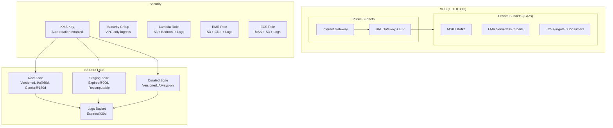

# ShopStream — Terraform Data Platform

Infrastructure as Code for an e-commerce data platform on AWS. Provisions networking, data lake storage, encryption, and IAM roles for data services. Built with reusable modules and automated CI/CD.

## Architecture



## Data Lake Zones

| Zone | Purpose | Lifecycle (dev) | Lifecycle (prod) | Versioning | Encryption |
|------|---------|----------------|-----------------|------------|------------|
| Raw | Immutable landing — data as received | IA@60d, Glacier@180d | IA@90d, Glacier@365d | Enabled | KMS |
| Staging | Cleaned/transformed intermediate | Delete@90d | Delete@180d | Disabled | KMS |
| Curated | Business-ready, served to consumers | Old versions expire@30d | Old versions expire@90d | Enabled | KMS |
| Logs | Access logs from all zones | Delete@30d | Delete@90d | Disabled | AES-256 |

## IAM Roles (Least Privilege)

| Role | Trusted Service | Permissions |
|------|----------------|-------------|
| `shopstream-{env}-lambda-role` | Lambda | Read/write raw+staging, Bedrock invoke, CloudWatch logs |
| `shopstream-{env}-emr-role` | EMR Serverless | Read raw+staging, write staging+curated, Glue catalog, logs |
| `shopstream-{env}-ecs-task-role` | ECS Tasks | MSK read/write, write staging, logs |

## CI/CD

GitHub Actions pipeline runs on every PR to `main`:

1. **Format Check** — `terraform fmt -check` (consistent style)
2. **Init** — downloads providers
3. **Validate** — syntax and reference checks
4. **Plan** — shows what would change (doesn't apply)

## Prerequisites

- Terraform >= 1.5.0
- AWS CLI configured with credentials
- AWS account with permissions to create IAM, S3, VPC, KMS resources
- GitHub repository secrets: `AWS_ACCESS_KEY_ID`, `AWS_SECRET_ACCESS_KEY`

## Usage

```bash
# Set credentials
source .env

# Initialize Terraform
terraform init

# Deploy dev environment
terraform plan -var-file=environments/dev.tfvars
terraform apply -var-file=environments/dev.tfvars

# Deploy prod environment
terraform plan -var-file=environments/prod.tfvars
terraform apply -var-file=environments/prod.tfvars

# Tear down
terraform destroy -var-file=environments/dev.tfvars
```

## File Structure

```
terraform-data-platform/
├── main.tf                        # Calls modules, wires them together
├── variables.tf                   # Root inputs with validation
├── outputs.tf                     # Exposes module outputs
├── environments/
│   ├── dev.tfvars                 # Dev settings (shorter retention, lower cost)
│   └── prod.tfvars                # Prod settings (longer retention, stricter)
├── modules/
│   ├── networking/                # VPC, subnets, NAT, route tables, SG
│   │   ├── main.tf
│   │   ├── variables.tf
│   │   └── outputs.tf
│   ├── data-lake/                 # S3 buckets, KMS, lifecycle, logging
│   │   ├── main.tf
│   │   ├── variables.tf
│   │   └── outputs.tf
│   └── iam/                       # IAM roles + least-privilege policies
│       ├── main.tf
│       ├── variables.tf
│       └── outputs.tf
├── .github/workflows/
│   └── terraform-plan.yml         # CI: fmt + validate + plan on PR
├── .env                           # AWS credentials (gitignored)
├── .gitignore                     # Excludes .env, .terraform/, state files
└── .terraform.lock.hcl            # Provider version lock
```

## Cost Estimate

| Resource | Monthly Cost |
|----------|-------------|
| NAT Gateway | ~$35 |
| KMS Key | ~$1 |
| S3 (minimal data) | < $1 |
| VPC/Subnets/SG | Free |
| IAM Roles | Free |
| **Total** | **~$37/month** |

## Design Decisions

- **Modular structure**: Each concern (networking, storage, IAM) is a reusable module with clear inputs/outputs
- **Environment separation via tfvars**: Same code deploys dev or prod with different retention/lifecycle settings
- **KMS over AES-256**: Provides audit trail (CloudTrail logs decryption calls) and ability to revoke access
- **3 private subnets**: MSK requires minimum 3 AZs for high availability
- **Separate lifecycle per zone**: Raw ages to cold storage, staging expires (recomputable), curated stays hot
- **Separate IAM policies per concern**: Each service gets only what it needs; policies can be detached independently
- **CI on PR**: Catches formatting issues, invalid config, and unexpected changes before merge
